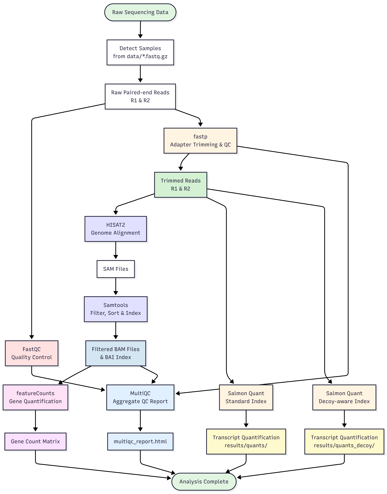
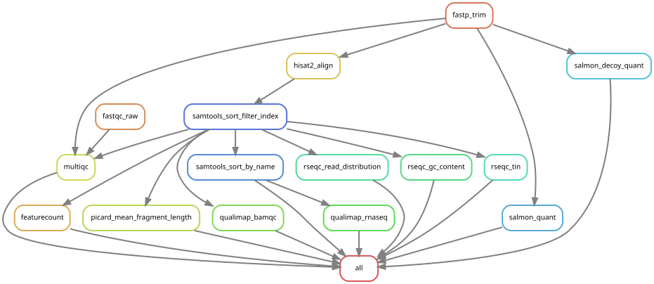

# Advanced RNA-seq Analysis Pipeline

[](https://github.com/gynecoloji/snakemake_RNAseq/actions/workflows/ci.yml)
[](https://github.com/gynecoloji/snakemake_RNAseq/releases)
[](https://snakemake.github.io)
[](https://hub.docker.com/r/gynecoloji/rnaseq_pipeline)
[](LICENSE)
<!-- After minting a Zenodo DOI, uncomment:
[](https://doi.org/10.5281/zenodo.XXXXXXX) -->

**A production-ready, containerized Snakemake workflow for comprehensive RNA-seq analysis**

Integrates alignment-based quantification (HISAT2), alignment-free quantification (Salmon), and extensive quality control in a single reproducible pipeline. Fully containerized with Docker and Singularity support for seamless deployment on workstations, cloud, and HPC systems.

---

## 🚀 Quick Start
```bash
# Clone the repository
git clone https://github.com/gynecoloji/snakemake_RNAseq.git
cd snakemake_RNAseq

# Prepare your data
mkdir -p data ref
cp /path/to/fastq/*_R1_001.fastq.gz data/
cp /path/to/fastq/*_R2_001.fastq.gz data/
cp /path/to/references/* ref/
# List your samples (sample_id column) in config/samples.csv

# Run with Docker (easiest) — builds core stage → advanced QC → Salmon in one DAG
docker compose build
docker compose run --rm rnaseq --cores 20

# Or run with Singularity / Apptainer (HPC). Apptainer auto-mounts the CWD.
apptainer pull rnaseq-pipeline.sif docker://gynecoloji/rnaseq_pipeline:latest
apptainer run rnaseq-pipeline.sif -s workflow/Snakefile --cores 20
```

**Results:** Check `results/multiqc_report.html` for comprehensive QC summary.

---

## 📊 Overview

This pipeline provides **three complementary workflows** for robust RNA-seq analysis:

| Pipeline | Purpose | Key Tools | Output |
|----------|---------|-----------|--------|
| **Core RNA-seq** | Read processing & gene quantification | FastQC, fastp, HISAT2, featureCounts | Gene counts, alignments |
| **Advanced QC** | Deep quality assessment | Picard, Qualimap, RSeQC | QC metrics, TIN scores |
| **Salmon** | Transcript quantification | Salmon (standard + decoy) | Transcript abundances |

### Pipeline Workflow
```
Raw FASTQ files
    ↓
[FastQC] → Quality assessment
    ↓
[fastp] → Adapter trimming & filtering
    ↓
[HISAT2] → Spliced alignment to genome
    ↓
[Samtools] → BAM filtering & sorting
    ↓
[featureCounts] → Gene-level quantification
    ↓
[MultiQC] → Comprehensive report
    ↓
[Picard/Qualimap/RSeQC] → Advanced QC metrics
    ↓
[Salmon] → Transcript-level quantification
```

**Why three pipelines?**
- **Alignment-based** (HISAT2): Gold standard for gene counts
- **Alignment-free** (Salmon): Fast, accurate transcript quantification
- **Multi-tool QC**: Comprehensive quality validation from multiple perspectives

---

## ✨ Key Features

- ✅ **Fully Containerized** - Docker & Singularity support (no manual installation)
- ✅ **HPC Ready** - SLURM/PBS job scripts included
- ✅ **Reproducible** - All dependencies pinned in conda environments
- ✅ **Comprehensive QC** - 7+ QC tools integrated
- ✅ **Production Tested** - Handles paired-end RNA-seq at scale
- ✅ **Well Documented** - Detailed guides for every use case
- ✅ **Flexible** - Run individual pipelines or all together

---

## 📖 Documentation

**Getting Started:**
- 🐳 [**Docker Guide**](DOCKER.md) - Build & run in a container
- 🖥️ [**HPC/Singularity Guide**](SINGULARITY_HPC.md) - Complete cluster deployment guide
- 🛠️ [**Setup Guide**](SETUP_GUIDE.md) - Detailed installation & customization

**Understanding the Pipeline:**
- 📋 [**Input Requirements**](#input-requirements) - Data preparation checklist
- 📊 [**Output Structure**](#output-description) - What gets generated
- ⚙️ [**Configuration**](#configuration) - All tunable parameters in `config/config.yaml`

**Need Help?**
- 🐛 [**Troubleshooting**](#troubleshooting) - Common issues & solutions
- 💡 [**Best Practices**](#best-practices) - Tips for optimal results

---

## 📥 Installation

### Option 1: Docker (Recommended for Local/Cloud)

**Requirements:** Docker ≥ 20.10, Docker Compose ≥ 1.29
```bash
# Clone repository
git clone https://github.com/gynecoloji/snakemake_RNAseq.git
cd snakemake_RNAseq

# Build image (one-time setup; pre-bakes the conda envs)
docker compose build

# Verify installation with a dry run
docker compose run --rm rnaseq -n
```

**Advantages:**
- ✅ Zero dependency installation
- ✅ Identical environment across systems
- ✅ Easy resource management

📖 **Full guide:** [DOCKER.md](DOCKER.md)

---

### Option 2: Singularity / Apptainer (Recommended for HPC)

**Requirements:** Singularity ≥ 3.x **or** Apptainer ≥ 1.0 (usually pre-installed on HPC)

> **Apptainer note:** [Apptainer](https://apptainer.org/) is the community-maintained fork of Singularity and is now the default on many HPC systems. Its CLI is a drop-in replacement — every `singularity <subcommand>` in this repo also works as `apptainer <subcommand>`. On most Apptainer installations, `singularity` is also provided as a compatibility symlink, so the commands below work unchanged. If not, either swap `singularity` → `apptainer`, or add a shell alias: `alias singularity=apptainer`.

```bash
# On HPC cluster - load module (name may vary: singularity, apptainer, or singularity-ce)
module load singularity   # or: module load apptainer

# Pull pre-built container (use `apptainer` in place of `singularity` if that's what your cluster has)
singularity pull rnaseq_pipeline.sif docker://gynecoloji/rnaseq_pipeline:latest

# Or build from local Docker image
docker save rnaseq_pipeline:latest | gzip > rnaseq_pipeline.tar.gz
# Transfer to HPC, then:
singularity build rnaseq_pipeline.sif docker-archive://rnaseq_pipeline.tar.gz
```

**Advantages:**
- ✅ No root access required
- ✅ Native HPC integration
- ✅ SLURM/PBS compatible

📖 **Full guide:** [SINGULARITY_HPC.md](SINGULARITY_HPC.md)

---

### Option 3: Local Conda (Advanced)

**Requirements:** Conda/Mamba, 64GB+ RAM
```bash
# Clone repository
git clone https://github.com/gynecoloji/snakemake_RNAseq.git
cd snakemake_RNAseq

# Driver env (Snakemake + pandas). The per-rule tool envs under workflow/envs/
# are created automatically on the first `--use-conda` run.
mamba create -n rnaseq -c conda-forge -c bioconda snakemake pandas
conda activate rnaseq
```

**Use this if:** You need to modify tool versions or can't use containers

📖 **Full guide:** [SETUP_GUIDE.md](SETUP_GUIDE.md)

---

### Quick Comparison

| Method | Setup Time | Reproducibility | HPC Support | Flexibility |
|--------|------------|-----------------|-------------|-------------|
| **Docker** | ~10 min | ⭐⭐⭐ | ❌ | ⭐⭐ |
| **Singularity** | ~15 min | ⭐⭐⭐ | ✅ | ⭐⭐ |
| **Conda** | ~30 min | ⭐⭐ | ✅ | ⭐⭐⭐ |

---

## 🚀 Usage

### Docker Usage

The image entrypoint is `snakemake --use-conda --conda-frontend mamba --conda-prefix /opt/wf-conda`, so anything after the image / service name is passed straight to Snakemake. The whole project is mounted at `/workflow`.

**Run everything (core stage → advanced QC → Salmon) in one DAG:**
```bash
# Using docker compose (simplest)
docker compose run --rm rnaseq --cores 20

# Or with docker run (mount the project; run as your host user)
docker run --rm -v "$(pwd)":/workflow -e HOME=/tmp --user "$(id -u):$(id -g)" \
  rnaseq-pipeline:latest -s workflow/Snakefile --cores 20
```

**Run a single stage (append the target):**
```bash
docker compose run --rm rnaseq --cores 10 rna_all      # core RNA-seq only
docker compose run --rm rnaseq --cores 10 qc_all       # advanced QC only
docker compose run --rm rnaseq --cores 10 salmon_all   # Salmon only
```

**Dry run (check the DAG without executing):**
```bash
docker compose run --rm rnaseq -n
```

See [DOCKER.md](DOCKER.md) for the full container guide (including building the Apptainer `.sif`).

---

### Singularity / Apptainer Usage (HPC)

> Commands below use `apptainer`; every one also works as `singularity` (identical CLI). Apptainer auto-mounts your home, `/tmp`, and the current directory and runs as you, so no `-B` bind or `--user` is needed when you run from the project directory.

**Get the image** — pull the published Docker image and convert once, or build natively from [`apptainer.def`](apptainer.def):
```bash
apptainer pull rnaseq-pipeline.sif docker://gynecoloji/rnaseq_pipeline:latest
# or, on a cluster without Docker:  apptainer build --fakeroot rnaseq-pipeline.sif apptainer.def
```

**Run (from your project directory — everything in one DAG):**
```bash
apptainer run rnaseq-pipeline.sif -s workflow/Snakefile --cores 20
# or a single stage:
apptainer run rnaseq-pipeline.sif -s workflow/Snakefile --cores 20 rna_all
```

**Submit to SLURM:**
```bash
#!/bin/bash
#SBATCH --job-name=rnaseq
#SBATCH --cpus-per-task=20
#SBATCH --mem=64G
#SBATCH --time=24:00:00

module load apptainer   # or: module load singularity

apptainer run rnaseq-pipeline.sif \
  -s workflow/Snakefile --cores ${SLURM_CPUS_PER_TASK} -p
```

📖 **Complete HPC guide with job scripts:** [SINGULARITY_HPC.md](SINGULARITY_HPC.md)

---

### Local Conda Usage
```bash
# Driver env (per-rule tool envs are built automatically on the first --use-conda run)
mamba create -n rnaseq -c conda-forge -c bioconda snakemake pandas
conda activate rnaseq

# Run everything (core stage → advanced QC → Salmon) in one dependency-ordered DAG
snakemake --use-conda -s workflow/Snakefile --cores 20 -p

# Or run a single stage
snakemake --use-conda -s workflow/Snakefile --cores 20 rna_all -p      # core RNA-seq
snakemake --use-conda -s workflow/Snakefile --cores 20 qc_all -p       # advanced QC
snakemake --use-conda -s workflow/Snakefile --cores 20 salmon_all -p   # Salmon

# Dry run first (recommended)
snakemake -n -s workflow/Snakefile
```

---

### Common Options

Everything runs through Snakemake targets on `workflow/Snakefile`:

| Argument | Description | Example |
|------|-------------|---------|
| *(no target)* | Build everything (core → QC → Salmon) | `snakemake -s workflow/Snakefile --cores 20` |
| `rna_all` | Core RNA-seq stage only | `... --cores 20 rna_all` |
| `qc_all` | Advanced-QC stage only | `... --cores 20 qc_all` |
| `salmon_all` | Salmon quantification only | `... --cores 20 salmon_all` |
| `--cores N` | Number of CPU cores | `--cores 10` |
| `-n` | Dry run (show what will run) | `snakemake -n -s workflow/Snakefile` |
| `-p` | Print shell commands | `-p` |

---

## 📦 Deploying with snakedeploy

This repository follows the [Snakemake Workflow Catalog](https://snakemake.github.io/snakemake-workflow-catalog/)
standardized layout (`workflow/Snakefile`, `config/`, `workflow/{rules,envs,schemas}/`,
and `.snakemake-workflow-catalog.yml`), so it can be deployed into another project
without cloning it by hand:

```bash
pip install snakedeploy
# In an empty target project directory:
snakedeploy deploy-workflow https://github.com/gynecoloji/snakemake_RNAseq . --tag main
```

This writes a `workflow/Snakefile` that `module`-imports this workflow, plus a
`config/` copy for you to edit. You can also import selected rules into your own
`Snakefile`:

```python
module rnaseq:
    snakefile:
        github("gynecoloji/snakemake_RNAseq", path="workflow/Snakefile", tag="main")
    config:
        config

use rule * from rnaseq
```

Then supply your own `config/config.yaml`, `config/samples.csv`, and `ref/`
reference data and run with `snakemake --use-conda`.

---

## 📁 Input Requirements

### Required Data Structure
```
project/
├── data/                          # Your FASTQ files
│   ├── sample1_R1_001.fastq.gz   # ⚠️ Must follow this naming pattern
│   ├── sample1_R2_001.fastq.gz
│   ├── sample2_R1_001.fastq.gz
│   └── sample2_R2_001.fastq.gz
├── ref/                           # Reference files (see "Reference Files" below)
│   ├── ENSEMBL/
│   │   └── genome.*.ht2          # HISAT2 index files (8 parts)
│   ├── Homo_sapiens.GRCh38.102.gtf # GTF annotation
│   ├── ENSEMBL_hg38.bed          # BED annotation for RSeQC
│   ├── picard.jar                # Picard executable JAR
│   ├── Salmon_index_Grch38/      # Standard Salmon index
│   └── Salmon_index_decoy_Grch38/ # Decoy-aware Salmon index
├── results/                       # Auto-created, pipeline outputs
└── logs/                          # Auto-created, log files
```

### Naming Convention (Critical!)

**FASTQ files must match:** `{sample}_R1_001.fastq.gz` and `{sample}_R2_001.fastq.gz`

✅ **Good:**
- `Control1_R1_001.fastq.gz` / `Control1_R2_001.fastq.gz`
- `Treatment_A_R1_001.fastq.gz` / `Treatment_A_R2_001.fastq.gz`

❌ **Bad:**
- `sample_1.fastq.gz` / `sample_2.fastq.gz` (wrong pattern)
- `data_read1.fq.gz` / `data_read2.fq.gz` (wrong extension)

### Reference Files (`ref/` folder)

All reference data is expected under the `ref/` directory at the project root. The reference paths are set in `config/config.yaml` (the `references:` section), so filenames and layout must match those values (or update the config).

**Indexes can be built for you.** The HISAT2 and Salmon indexes below are built
automatically from source FASTAs when they are absent — just provide a genome FASTA
(`genome_fasta`, default `ref/genome.fa`) and a transcriptome FASTA
(`transcriptome_fasta`, default `ref/transcripts.fa`) instead of pre-building them.
If a pre-built index is already present, the build step is skipped and the source
FASTAs are never read. The GTF, RSeQC BED, and `picard.jar` are downloads, not built.

| Path | Used by | What it is | How to obtain |
|------|---------|------------|---------------|
| `ref/ENSEMBL/genome.{1..8}.ht2` | `rna_all` | HISAT2 index (8 files, prefix `genome`) | **Built automatically** from `genome_fasta` when absent. Or bring your own: `hisat2-build genome.fa ref/ENSEMBL/genome`, or a prebuilt index from the [HISAT2 site](https://daehwankimlab.github.io/hisat2/download/) (rename prefix to `genome`) |
| `ref/Homo_sapiens.GRCh38.102.gtf` | `rna_all`, `qc_all` | ENSEMBL gene annotation (GTF, uncompressed) | `wget https://ftp.ensembl.org/pub/release-102/gtf/homo_sapiens/Homo_sapiens.GRCh38.102.gtf.gz && gunzip Homo_sapiens.GRCh38.102.gtf.gz` |
| `ref/ENSEMBL_hg38.bed` | `qc_all` (RSeQC) | 12-column BED of gene models for RSeQC `read_distribution.py` / `tin.py` | Download from [RSeQC reference BEDs](https://sourceforge.net/projects/rseqc/files/BED/) or convert your GTF (`gtfToGenePred` → `genePredToBed`) |
| `ref/picard.jar` | `qc_all` | Picard Tools executable JAR | `wget https://github.com/broadinstitute/picard/releases/latest/download/picard.jar -O ref/picard.jar` |
| `ref/Salmon_index_Grch38/` | `salmon_all` | Standard Salmon transcriptome index (directory) | **Built automatically** from `transcriptome_fasta` when absent. Or bring your own: `salmon index -t transcripts.fa -i ref/Salmon_index_Grch38 -k 31` |
| `ref/Salmon_index_decoy_Grch38/` | `salmon_all` | Decoy-aware Salmon index (transcriptome + genome decoys) | **Built automatically** from `transcriptome_fasta` + `genome_fasta` when absent. Or follow the [Salmon decoy-aware guide](https://salmon.readthedocs.io/en/latest/salmon.html#preparing-transcriptome-indices-mapping-based-mode) |
| `ref/genome.fa` | index build | Genome FASTA — source for building the HISAT2 index and Salmon decoys | UCSC/ENSEMBL genome FASTA; only needed if you don't provide pre-built HISAT2 / decoy indexes |
| `ref/transcripts.fa` | index build | Transcriptome FASTA — source for building the Salmon indexes | ENSEMBL cDNA (e.g. `Homo_sapiens.GRCh38.cdna.all.fa`); only needed if you don't provide pre-built Salmon indexes |

**Notes:**
- The GTF/BED above are for ENSEMBL release 102, GRCh38 (human). For other species or releases, substitute the equivalent files and update the paths in the relevant snakefile.
- The GTF must match the genome build the HISAT2 index was constructed against, and the transcriptome used for Salmon indices.
- Only the files required for the stage(s) you intend to run need to be present — e.g. if you only run `salmon_all`, you can skip the HISAT2 index and `picard.jar`.

### Reference Files Checklist

Provide **either** a pre-built index **or** the source FASTA for each build step:

- [ ] **HISAT2 index** — `ref/ENSEMBL/genome.*.ht2` **or** `ref/genome.fa` to auto-build (for `rna_all`)
- [ ] **GTF annotation** — `ref/Homo_sapiens.GRCh38.102.gtf` (for `rna_all`, `qc_all`)
- [ ] **BED annotation** — `ref/ENSEMBL_hg38.bed` (for `qc_all` / RSeQC)
- [ ] **Picard JAR** — `ref/picard.jar` (for `qc_all`)
- [ ] **Salmon standard index** — `ref/Salmon_index_Grch38/` **or** `ref/transcripts.fa` to auto-build (for `salmon_all`)
- [ ] **Salmon decoy index** — `ref/Salmon_index_decoy_Grch38/` **or** `ref/transcripts.fa` + `ref/genome.fa` to auto-build (for `salmon_all`)

📖 **How to prepare references:** See [SETUP_GUIDE.md](SETUP_GUIDE.md#reference-preparation)

---

## ⚙️ Configuration

All tunable parameters live in **`config/config.yaml`**; samples are listed in **`config/samples.csv`**. `workflow/Snakefile` reads them via `configfile: "config/config.yaml"` and validates against [`workflow/schemas/config.schema.yaml`](workflow/schemas/config.schema.yaml) — the single source of truth for parameter types, defaults, and descriptions — on every run.

### Override at runtime

```bash
# Use a custom config file
snakemake --configfile my_config.yaml --cores 20 -s workflow/Snakefile

# In Docker / Apptainer the whole project is mounted at /workflow, so just edit
# config/config.yaml and config/samples.csv before running — no rebuild needed.
docker run --rm -v "$(pwd)":/workflow -e HOME=/tmp --user "$(id -u):$(id -g)" \
  rnaseq-pipeline:latest -s workflow/Snakefile --cores 20
```

### Configurable sections

| Section | Keys | What it controls |
|---|---|---|
| `genome` | `species`, `build`, `release` | Informational metadata for logs/docs |
| `paths` | `data_dir`, `results_dir`, `logs_dir`, `ref_dir` | Where inputs/outputs live |
| `samples` | `r1_suffix`, `r2_suffix` | FASTQ naming convention |
| `references` | `hisat2_index`, `gtf`, `bed`, `picard_jar`, `salmon_index`, `salmon_decoy_index`, `genome_fasta`, `transcriptome_fasta` | Reference file paths (incl. source FASTAs for on-demand index building) |
| `index` | `hisat2_splice_aware`, `salmon_kmer` | On-demand index-building options |
| `threads` | `fastqc`, `fastp`, `hisat2`, `samtools`, `samtools_byname`, `featurecounts`, `multiqc`, `picard`, `qualimap_bamqc`, `qualimap_rnaseq`, `rseqc`, `salmon` | Per-rule CPU allocation |
| `fastp` | `extra` | Extra fastp flags (e.g. SE vs PE, custom adapters) |
| `hisat2` | `extra` | Library/alignment params |
| `samtools_filter` | `require_flags`, `exclude_flags`, `unique_tag` | BAM filter rules |
| `featurecounts` | `feature_type`, `attribute`, `strandedness`, `extra` | Counting strategy |
| `qualimap` | `java_mem`, `protocol` | JVM heap + library protocol |
| `salmon` | `lib_type`, `extra` | Library type + extra Salmon flags |

### Common adjustments

**Switch to a different organism (e.g. mouse):**
```yaml
genome:
  species: "Mus_musculus"
  build: "GRCm39"
  release: "110"
references:
  hisat2_index: "ref/mouse/genome"
  gtf:          "ref/Mus_musculus.GRCm39.110.gtf"
  bed:          "ref/mm10.bed"
```

**Switch to stranded RNA-seq (forward-stranded library):**
```yaml
featurecounts:
  strandedness: 1
qualimap:
  protocol: "strand-specific-forward"
```

**Run on a low-RAM machine:**
```yaml
threads:
  hisat2: 8
  samtools: 8
  featurecounts: 8
  salmon: 8
qualimap:
  java_mem: "8G"
```

📖 See [`config/config.yaml`](config/config.yaml) for the full annotated file.

---

## 📊 Output Description

### Directory Structure
```
results/
├── fastqc/raw/              # Raw read quality reports
│   ├── {sample}_R1_001_fastqc.html
│   └── {sample}_R2_001_fastqc.html
│
├── trimmed/                 # Trimmed reads & fastp reports
│   ├── {sample}_R1.trimmed.fastq.gz
│   ├── {sample}_R2.trimmed.fastq.gz
│   ├── {sample}_fastp.html
│   └── {sample}_fastp.json
│
├── hisat2/                  # Alignment files
│   ├── {sample}.sam
│   └── {sample}.sam.summary
│
├── samtools/                # Processed BAM files
│   ├── {sample}.sorted.filtered.bam
│   ├── {sample}.sorted.filtered.bam.bai
│   └── {sample}_summary.txt (flagstat)
│
├── featurecounts/           # Gene-level counts
│   └── featureCount.txt     # ⭐ Main count matrix
│
├── picard/                  # Fragment size metrics
│   ├── {sample}_insert_size_metrics.txt
│   └── {sample}_Histogram.pdf
│
├── qualimap_bamqc/          # Alignment QC
│   └── {sample}/
│       └── {sample}.pdf
│
├── qualimap_rnaseq/         # RNA-seq specific QC
│   └── {sample}/
│
├── rseqc/                   # Advanced RNA metrics
│   ├── {sample}_RD_summary.txt (read distribution)
│   ├── {sample}_GC_content.GC.xls
│   └── {sample}.sorted.filtered.tin.xls (transcript integrity)
│
├── quants/                  # Salmon standard quantification
│   └── {sample}_quant/
│       └── quant.sf         # ⭐ Transcript abundances
│
├── quants_decoy/            # Salmon decoy quantification
│   └── {sample}_quant/
│       └── quant.sf
│
├── multiqc_report.html      # 🎯 START HERE - Combined QC report
└── multiqc_data/            # Data behind MultiQC report
```

### Key Output Files

| File | Description | Use Case |
|------|-------------|----------|
| **multiqc_report.html** | 🎯 Aggregated QC from all tools | First check - overall quality |
| **featureCount.txt** | Gene-level count matrix | DESeq2, edgeR analysis |
| **quant.sf** | Transcript abundances (TPM) | Isoform analysis, sleuth |
| **{sample}.sorted.filtered.bam** | Aligned reads | IGV visualization |
| **{sample}.tin.xls** | Transcript integrity scores | RNA quality assessment |

### What to Check First

1. **MultiQC Report** - Overview of all samples
   - Open `results/multiqc_report.html` in browser
   - Check for failed samples, outliers

2. **Alignment Rates** - In MultiQC or HISAT2 summaries
   - Good: >80% aligned
   - Acceptable: 70-80%
   - Investigate: <70%

3. **Feature Counts** - Gene quantification
   - Located: `results/featurecounts/featureCount.txt`
   - Use for differential expression analysis

4. **Transcript Integrity** - RNA degradation check
   - Located: `results/rseqc/{sample}.sorted.filtered.tin.xls`
   - Good: TIN score >70
   - Degraded: TIN score <60

---

## 🏆 Contributing

Contributions are welcome! Please feel free to:

- 🐛 Report bugs or issues
- 💡 Suggest new features or improvements
- 📝 Improve documentation
- 🔧 Submit pull requests

**Before contributing:**
1. Check existing issues/PRs
2. Open an issue to discuss major changes
3. Follow existing code style
4. Update documentation as needed

---

## 📝 Citation

If you use this pipeline in your research, please cite:
```bibtex
@software{rnaseq_pipeline_2025,
  author = {gynecoloji},
  title = {Advanced RNA-seq Analysis Pipeline},
  year = {2025},
  url = {https://github.com/gynecoloji/snakemake_RNAseq},
  version = {1.0}
}
```

**Please also cite the tools used in the pipeline:**

- **Snakemake:** Mölder et al. (2021) https://doi.org/10.12688/f1000research.29032.2
- **HISAT2:** Kim et al. (2019) https://doi.org/10.1038/s41587-019-0201-4
- **Salmon:** Patro et al. (2017) https://doi.org/10.1038/nmeth.4197
- **FastQC:** https://www.bioinformatics.babraham.ac.uk/projects/fastqc/
- **fastp:** Chen et al. (2018) https://doi.org/10.1093/bioinformatics/bty560
- **featureCounts:** Liao et al. (2014) https://doi.org/10.1093/bioinformatics/btt656
- **MultiQC:** Ewels et al. (2016) https://doi.org/10.1093/bioinformatics/btw354
- **RSeQC:** Wang et al. (2012) https://doi.org/10.1093/bioinformatics/bts356
- **Qualimap:** Okonechnikov et al. (2016) https://doi.org/10.1093/bioinformatics/btv566

---

## 📄 License

This project is licensed under the **MIT License** - see the [LICENSE](LICENSE) file for details.

**Summary:**
- ✅ Commercial use allowed
- ✅ Modification allowed
- ✅ Distribution allowed
- ✅ Private use allowed
- ⚠️ No warranty provided
- ⚠️ No liability

---

## 📧 Contact & Support

**Author:** gynecoloji

**Get Help:**
- 🐛 **Bug Reports:** [Open an issue](https://github.com/gynecoloji/snakemake_RNAseq/issues)
- 💬 **Questions:** [Start a discussion](https://github.com/gynecoloji/snakemake_RNAseq/discussions)
- 📧 **Email:** [Contact via GitHub](https://github.com/gynecoloji)

**Community:**
- ⭐ Star this repo if you find it useful!
- 🔄 Fork it for your own modifications
- 📢 Share with colleagues

---

## 🙏 Acknowledgments

This pipeline integrates tools developed by the bioinformatics community. Special thanks to:

- The Snakemake team for the workflow framework
- All tool developers for their excellent software
- The Conda/Bioconda teams for package management
- Docker and Singularity communities for containerization support

---

## 📊 Pipeline Statistics



The Snakemake rule graph (auto-generated from the `.test/` fixture):



- **Tools Integrated:** 10+
- **QC Metrics:** 20+
- **Containerization:** Docker + Singularity
- **Environments:** 4 isolated conda environments
- **Reproducibility:** All dependencies pinned

---

## 🚀 Quick Links

| Resource | Link |
|----------|------|
| 🏠 **Home** | [GitHub Repository](https://github.com/gynecoloji/snakemake_RNAseq) |
| 🐳 **Docker Hub** | [gynecoloji/rnaseq_pipeline](https://hub.docker.com/r/gynecoloji/rnaseq_pipeline) |
| 📖 **Documentation** | [Guides & Tutorials](#documentation) |
| 🐛 **Issues** | [Report Problems](https://github.com/gynecoloji/snakemake_RNAseq/issues) |
| ⭐ **Star** | [Star this repo](https://github.com/gynecoloji/snakemake_RNAseq) |

---

## 📅 Version History

**v1.0** (January 2025)
- ✨ Initial release with Docker support
- ✨ Singularity/HPC integration
- ✨ Three integrated pipelines (RNA-seq, QC, Salmon)
- ✨ Comprehensive documentation
- ✨ Production-ready workflows

---

<div align="center">

**Built with ❤️ for the bioinformatics community**

Last updated: April 2026

[⬆ Back to Top](#advanced-rna-seq-analysis-pipeline)

</div>